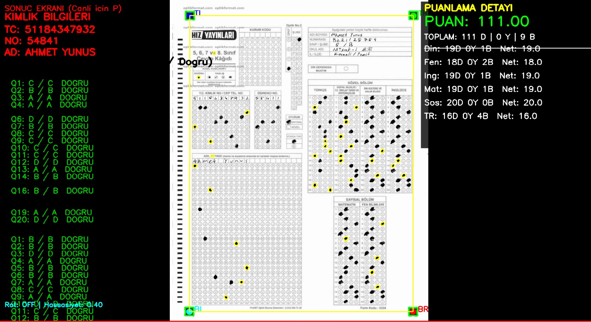

# 📝 Optic Form Reader (C++ OMR Engine)

Bu proje, C++ kullanılarak geliştirilmiş yüksek performanslı bir **Optik İşaret Tanıma (OMR - Optical Mark Recognition)** motorudur. Kamera veya tarayıcıdan alınan optik form görüntülerini işler, perspektif hatalarını düzeltir ve işaretlenmiş şıkları otomatik olarak algılayarak puanlama yapar.

## 🚀 Özellikler

Bu motor, bir optik formun okunması için gereken tüm görüntü işleme adımlarını içerir:

* **Otomatik Köşe Tespiti (Corner Detection):** Formun görüntü üzerindeki köşelerini tespit eder.
* **Perspektif Düzeltme (Perspective Correction):** Eğik veya açılı çekilmiş fotoğrafları kuş bakışı (dik) görünüme dönüştürür.
* **ROI (İlgi Alanı) Analizi:** Kimlik numarası, cevap alanları gibi bölgeleri ayrıştırır.
* **Baloncuk Algılama (Bubble Detection):** İşaretlenmiş ve boş bırakılmış kutucukları hassas bir şekilde ayırt eder.
* **Cevap Anahtarı Yönetimi:** Tespit edilen şıkları doğru cevap anahtarı ile karşılaştırır.
* **JSON Çıktısı:** Sonuçları modern uygulamalarla entegre olabilmesi için JSON formatında dışarı aktarır.

## 🛠️ Teknolojiler

* **Dil:** C++ (Modern C++ standartları)
* **Derleme:** CMake
* **Kütüphaneler:** * *nlohmann/json* (Veri çıktısı için)
    * *OpenCV*

---
## 📷 Örnek Çalışma Çıktısı

Aşağıdaki görselde, programın bir optik formu nasıl işlediği, işaretleri nasıl algıladığı ve puanlamayı nasıl hesapladığı görülmektedir.



## 📦 Kurulum ve Çalıştırma

Projeyi yerel makinenizde derlemek için aşağıdaki adımları izleyebilirsiniz:

```bash
# Projeyi klonlayın
git clone [https://github.com/skypieaqc/Optic-Reader.git](https://github.com/skypieaqc/Optic-Reader.git)

# Proje dizinine girin
cd Optic-Reader

# Build klasörü oluşturun ve derleyin
mkdir build
cd build
cmake ..
make

# Uygulamayı çalıştırın
./OpticReader
